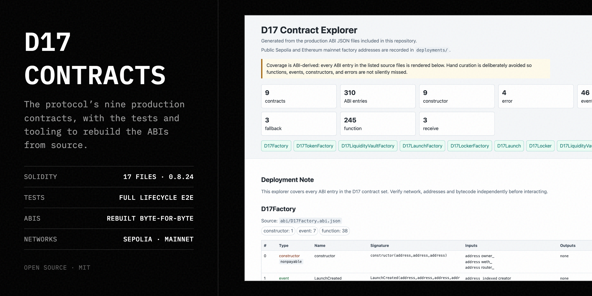

# D17 Contracts



Solidity source for the D17 factory suite and the contracts created for each
launch. The suite uses Solidity 0.8.24, IR compilation, optimizer runs 1, the
Shanghai EVM target and no metadata bytecode hash.

## Contract set

- `D17Factory`
- `D17TokenFactory`
- `D17LiquidityVaultFactory`
- `D17LaunchFactory`
- `D17LockerFactory`
- `D17Token`
- `D17Launch`
- `D17Locker`
- `D17LiquidityVault`

Interfaces and the transfer helper are under `contracts/interfaces` and
`contracts/lib`.

## Read the system

- [Architecture](./docs/ARCHITECTURE.md)
- [ABI traceability](./docs/ABI_TRACEABILITY.md)
- [Testing](./docs/TESTING.md)
- [Interactive contract explorer](./docs/contract-explorer.html)
- [Security policy](./SECURITY.md)

## Compile and test

Use Node.js 22.13 LTS or Node.js 24+:

```bash
npm ci
npm run compile
npm test
npm run build:abi
npm run check:explorer
```

The local end-to-end suite covers factory wiring, metadata, configuration
bounds, failed launches, all five rounds, refunds, finalization, settlement,
pool creation, late liquidity top-ups, price divergence, token conservation and
adversarial reverts.

## Public deployments

`deployments/sepolia.json` and `deployments/mainnet.json` contain the public
factory addresses, WETH/router addresses and deployment start blocks. The D17
factory addresses are the same on both networks; WETH and router addresses are
network-specific.

Individual launches are created through `D17Factory.createLaunch`. This
repository does not contain a sample mainnet launch or any deployment key.

## Deploying another factory suite

Copy the appropriate example to the `.env` file read by the deployment scripts:

```bash
# Sepolia
cp .env.example .env

# Or Ethereum mainnet
cp .env.mainnet.example .env
```

Supply an RPC endpoint and locally funded deployment wallets in `.env`, inspect
the scripts, then run:

```bash
npm run deploy:factory
npm run verify:factory
```

Mainnet deployment requires the explicit script confirmation. Pin every
component before renouncing factory ownership. Once ownership is renounced,
the recovery path for an incorrect immutable deployment is a new deployment.

## Creating a launch

The applications call `createLaunch` through a browser wallet. Developers who
prefer a local command-line signer can use `npm run create:launch` after
reviewing the script and configuration.

Never commit a private key, seed phrase, populated `.env`, generated wallet
file or deployment credential.
